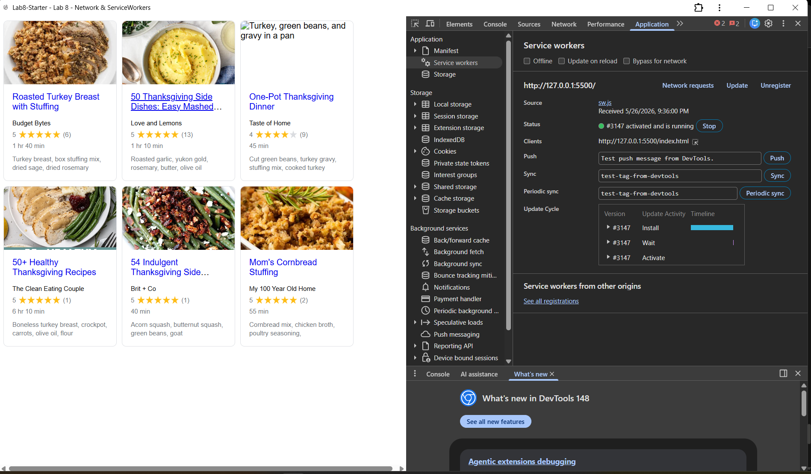

# Lab8-Starter

# Luke Deverian

[link](https://lukemdeverian.github.io/Lab8_Starter/)

# How are graceful degradation and service workers related?
- Graceful degradation means building an app that works great under normal conditions but still works at a basic level when something goes wrong. Service workers help with this because they cache your app's files and data the first time a user visits. If the user loses their internet connection later, the service worker can serve those saved files instead of failing completely. So rather than showing a broken page with no internet, the app still loads and works thanks to the service worker.

